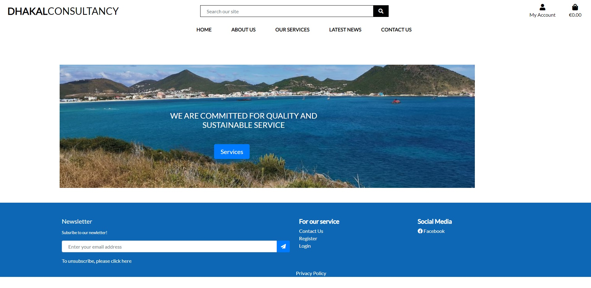
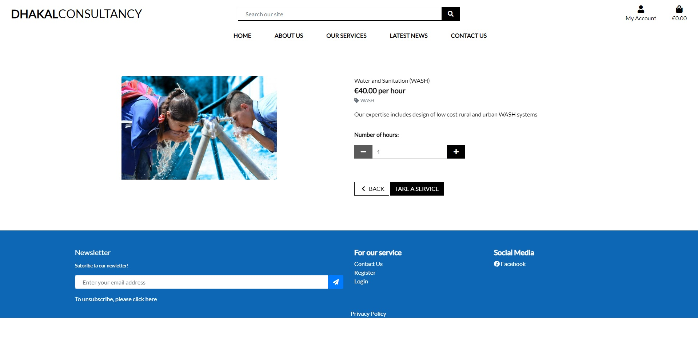
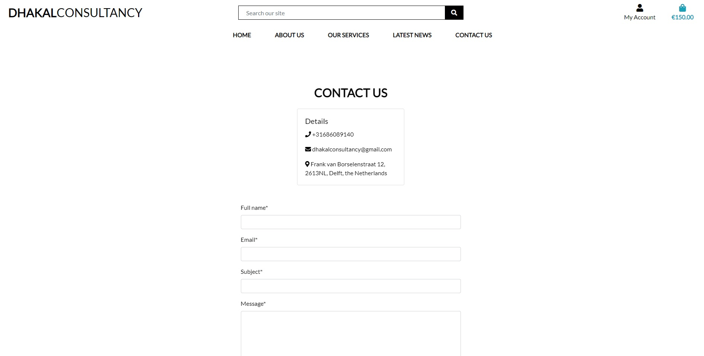
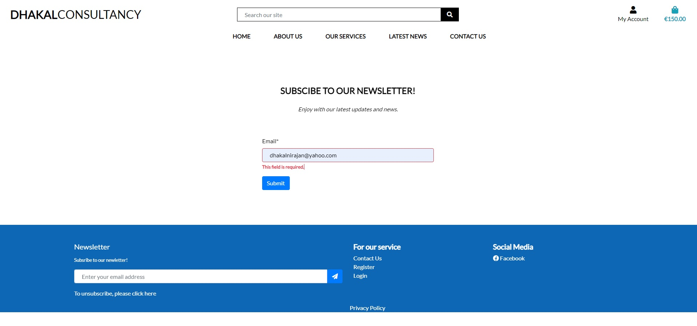
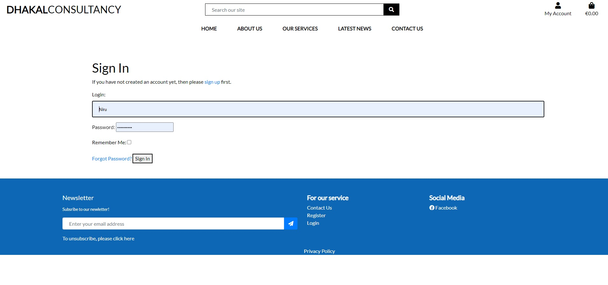
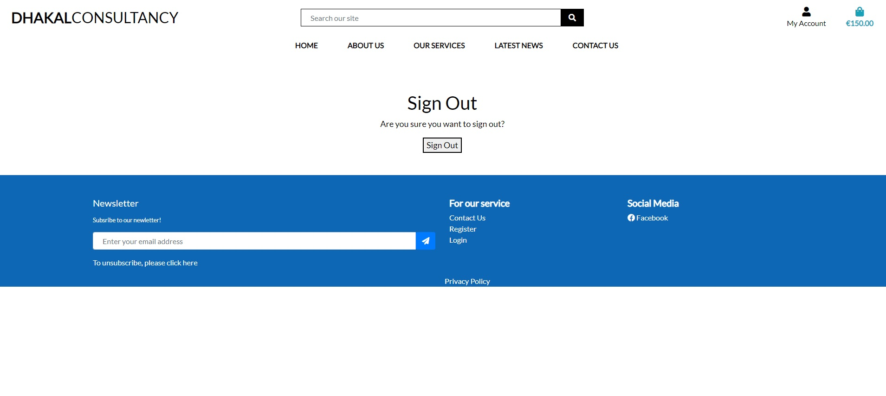

# Dhakal Consultancy 
Welcome! 
## Introduction
The global water crisis is a major concern today and will become more severe in the coming years. The availability of freshwater becomes more challenging in the semi-arid regions. However, in other areas where freshwater is available(surface and groundwater),contamiantion and degradation of the water quality is a major issue risking the health of millions of people. As per the SDG 6, availability of fresh and safe water for all is a basic necessity for overall human development. Therefore, there is a need of experts in this field who can provide the solutions/ideas instantly/remotely so the action on site can be taken immediately. 

The overall aim of Dhakal Consultancy is to sell its consultancy services worldwide in the field of water treatment, desaliantion, water and sanitation as well as web design(frontend and backend). This project is created as a part of Code Institute's Full Stack Software Development course.
The admin of the website will have the ability to use all CRUD functionality (Create, Read, Update, Delete).

A live website can be found [here](https://dhakalconsultancy.herokuapp.com/).

# Table of Contents
 [1. About the Dhakal Consultancy](#dhakal-consultancy)

 [2. User Expereince (UX) design](#ux)
  - [Project Goals:](#project-goals)
  - [User Goals:](#user-goals)

  [3. Structure (Models used):](#models)
  
  [4. Site Skeleten(Wireframe):](#wireframe)

 [5. Features](#features)
 - [Existing features](#exist-feature)
 - [future features](#future-feature)

 [6.Technologies used](#technologies-used)

 [7.Testing](#testing)

 [8.Bugs](#bugs)

 [9. Deployment](#deployment)

 [10. SEO](#seo)

 [11. Marketing](#marketing)

 [12. Social Media](#social-media)

[13. Acknowledgement](#acknowledgement)

  

# 1. About the Dhakal Consultancy website
  [Go to the top](#table-of-contents)

This consultancy website is desinged as a a platform to sell the expertise in the field of water and full-stack software.  
   
# 2. User Expereince (UX) design
  [Go to the top](#table-of-contents)

  Water crisis is now a global issue which can be addressed by the joint efforts from professional working in this field. Therefore, sharing of knowledge and expereience among professional is important mainly to i)to save the available resources and time and ii) solve the global water issue. This project is thus aimed to design the user friendly water channel blog which allows all water professional to register and participate in sharing their knowledge and experience in water related issues.  

The following users types can be benifitted from the blog:

- Water professionals
- Students in field of water.
- University/institution who can consider the platform for thier educational activities.

   
## 2.1 Project Goals
  [Go to the top](#table-of-contents)

The main goal of this project is to develop a full-stack ecommerce web application to sell consultancy services in the field of water treatment, desaliantion, water and sanitation as well as frontend and backend coding applications to customer from entire world.  

   
## 2.2 User Goals
  [Go to the top](#table-of-contents)

First Time Visitor Goals

-  Be able to see some information about the consultancy so that he/she knows the background and history of the company.
- Be able to view the list of available services so that he/she can select the service that they are interested for
- Be able to easily view the details about the service so that he/she can can decide whether to take the service or not.

- Option to search for a service available by name or description so that he/she can find a specific service that I am interested on.
- Be able to easily add service items to my purchase basket so that he/she can view all the services that are interested for 

- Be able to easily remove items and update quantities of service from my purchase service list so that he/she can remove any services that is not of interest from the list.
- Be able to select the the number of service hours of a service when selecting the particular service so that he/she can select the service with actual hours interested in.
- Be able to easily enter my payment information at the checkout page so that he/she can checkout with no hassles.
- Be able to receive an email confirmation after completing the checkout process so that he/she can have the proof of payment for the service requested.
- Be able to see a contact page where i can write my details and questions so that I can send any query and make an appointment to discuss about the service.

Returning Visitor Goals
- Be able to easily register an account so that he/she can have a personal account and be able to view profile.
- Be able to receive an email confirmation after registering so that I can verify that my account registration is successful.
- Be able to easily login or logout so that he/she can access his/her personal account information.
- Be able to easily reset my password in case I forget it so that I can have an access to my account.

Frequent User Goals
-   Be able to subscribe for newsletter so that I can follow the update of the organization.
- Be able to unsubscribe for newsletter so that I can stop to follow the update of the organization anytime i wish.

Three step processes were followed as below:
- Set the user requirements and added to the user stories within the github project

- After the gradual fullfilment of the requirements, the stories were moved to in progress column.

- And finally when requirement was fully met, it was moved to the complete column.

  
## 3. Site Skeleten (models)
  [Go to the top](#table-of-contents)

### 3.1 Service models
This model was used to display the list of services available within the scope of Dhakal Consultancy. The fixtures Json files for categories and services were written.

class Category(models.Model):

    class Meta:
        verbose_name_plural = 'Categories'

    name = models.CharField(max_length=254)
    friendly_name = models.CharField(max_length=254, null=True, blank=True)

    def __str__(self):
        return self.name

    def get_friendly_name(self):
        return self.friendly_name

class Service(models.Model):

    category = models.ForeignKey('Category', null=True, blank=True, on_delete=models.SET_NULL)
    name = models.CharField(max_length=254)
    blurb = models.TextField()
    price = models.DecimalField(max_digits=6, decimal_places=2)
    image_url = models.URLField(max_length=1024, null=True, blank=True)
    image = models.ImageField(null=True, blank=True)

    def __str__(self):
        return self.name

### 3.2 Checkout model
This model was used to for users to checkout with the services they are interested for and go for stripe payment. All the detail information of the buyer can be written during the checkout and which will generate the order number for customer reference. 

class Order (models.Model):

    """Model for the order object"""

    order_number = models.CharField(max_length=32, null=False, editable=False)
    user_profile = models.ForeignKey(
        UserProfile, on_delete=models.SET_NULL, null=True, blank=True,
        related_name='orders')
    full_name = models.CharField(max_length=50, null=False, blank=False)
    email = models.CharField(max_length=254, null=False, blank=False)
    phone_number = models.CharField(max_length=20, null=False, blank=False)
    country = models.CharField(max_length=40, null=False, blank=False)
    postcode = models.CharField(max_length=20, null=True, blank=True)
    town_or_city = models.CharField(max_length=40, null=False, blank=False)
    street_address1 = models.CharField(max_length=80, null=False, blank=False)
    street_address2 = models.CharField(max_length=80, null=True, blank=True)
    county = models.CharField(max_length=80, null=True, blank=True)
    date = models.DateField(auto_now_add=True)
    delivery_cost = models.DecimalField(max_digits=6, decimal_places=2, null=False, default=0)
    order_total = models.DecimalField(max_digits=10, decimal_places=2, null=False, default=0)
    grand_total = models.DecimalField(max_digits=10, decimal_places=2, null=False, default=0)
    original_purchase = models.TextField(null=False, blank=False, default="")
    stripe_pid = models.CharField(max_length=254, null=False, blank=False, default="")
    user = models.CharField(max_length=150, null=True, blank=True)

def _generate_order_number(self):
        """
        Use UUID to generate a unique order number.
        """
        return uuid.uuid4().hex.upper()

    def update_total(self):
        """
        Update grand total each time a line item is added.
        """
        self.order_total = self.lineitems.aggregate(Sum("lineitem_total"))["lineitem_total__sum"] or 0
        if self.order_total < settings.FREE_DELIVERY_THRESHOLD:
            self.delivery_cost = self.order_total * settings.STANDARD_DELIVERY_PERCENTAGE / 100
        else:
            self.delivery_cost = 0
        self.grand_total = self.order_total + self.delivery_cost
        self.save()

    def save(self, *args, **kwargs):
        """
        Generate an order number if one hasn't been set already
        """
        if not self.order_number:
            self.order_number = self._generate_order_number()
        super().save(*args, **kwargs)

    def __str__(self):
        return self.order_number

class OrderLineItem(models.Model):

    """Model for the order line item object"""

    order = models.ForeignKey(Order, null=False, blank=False, on_delete=models.CASCADE, related_name="lineitems")
    service = models.ForeignKey(Service, null=False, blank=False, on_delete=models.CASCADE)
    quantity = models.IntegerField(null=False, blank=False, default=0)
    lineitem_total = models.DecimalField(max_digits=6, decimal_places=2, null=False, blank=False, editable=False)

    def save(self, *args, **kwargs):
        """
        Override the original save method to set the lineitem total
        and update the order total.
        """
        self.lineitem_total = self.service.price * self.quantity
        super().save(*args, **kwargs)

    def __str__(self):
        return self.order.order_number

### 3.3 Profiles model

This model was used to for users to create their profiles and register their history of order.

class UserProfile(models.Model):

    user = models.OneToOneField(User, on_delete=models.CASCADE)
    default_phone_number = models.CharField(
        max_length=20, null=True, blank=True)
    default_street_address_1 = models.CharField(
        max_length=80, null=True, blank=True)
    default_street_address_2 = models.CharField(
        max_length=80, null=True, blank=True)
    default_town_or_city = models.CharField(
        max_length=40, null=True, blank=True)
    default_postcode = models.CharField(
        max_length=20, null=True, blank=True)
    default_county = models.CharField(
        max_length=80, null=True, blank=True)
    default_country = CountryField(
        blank_label="Country", null=True, blank=True)

    def __str__(self):
        return self.user.email

@receiver(post_save, sender=User)

def create_or_update_user_profile(sender, instance, created, **kwargs):

    """Create or update the user profile """

    try:
        instance.userprofile.save()
    except ObjectDoesNotExist:
        UserProfile.objects.create(user=instance)

### 3.4 Contact model

This model was used to for users to contact the admin of Dhakal Consultancy using a contact form as well subscribe for the newsletter.

class Contact(models.Model):

    full_name = models.CharField(max_length=254, null=False, blank=False)
    email = models.EmailField(max_length=254, null=False, blank=False)
    subject = models.CharField(max_length=50, null=False, blank=False)
    message = models.TextField(max_length=254, null=False, blank=False)

class NewletterSubscriber(models.Model):

    email = models.EmailField(max_length=254, null=False, blank=False)
    date = models.DateTimeField(auto_now_add=True)

    def __str__(self):
        return self.email

### 3.5 Publish model

This model was used by admin to add, edit, delete the news post in the website of Dhakal Consultancy. 

class Post(models.Model):

    title = models.CharField(max_length=250)
    slug = models.SlugField(max_length=250, unique_for_date="publish")
    author = models.ForeignKey(User, on_delete=models.CASCADE,
                               related_name="news_post")
    body = models.TextField()
    publish = models.DateTimeField(default=timezone.now)
    created = models.DateTimeField(auto_now_add=True)

    class Meta:
        ordering = ["-publish", ]

    def __str__(self):
        return self.title + ' |' + str(self.author)

    def get_absolute_url(self):
        return reverse("news_post",
                       args=[self.publish.year, self.publish.month,
                             self.publish.day, self.publish.hour,
                             self.publish.minute, self.slug])

    def get_edit_url(self):
        return reverse("edit_post",
                       args=[self.publish.year, self.publish.month,
                             self.publish.day, self.publish.hour,
                             self.publish.minute, self.slug])

    def get_delete_url(self):
        return reverse("delete_post",
                       args=[self.publish.year, self.publish.month,
                             self.publish.day, self.publish.hour,
                             self.publish.minute, self.slug])

  
## 4. Site Skeleten (wireframe)
  [Go to the top](#table-of-contents)

[Balsamiq](https://balsamiq.com/) was used to create wireframes of the website. This was very useful as it gives the template of the UI. Wireframes were designed for  mobile browser format. The concept design (wireframes) of webpages of the water channel prepared is presented below.

### Home page 

### About us 

### Our service 

### Service details 

### Checkout 

### Order confirmation

### Latest News 

### News details 

### Contact us 

 

# 3. Features
  [Go to the top](#table-of-contents)

## 3.1 Existing Feature

### 3.1.1 Navigation bar:
Dhakal consultancy has naviagation bar that includes; 
- Home page
- About us
- Our services 
- Latest news
- contact us 
- My account 
- Purchase bag 

Any users have an ability to view the home page, page detail view, register in the webpage and login as registered user.

- Link for Social media(facebook) and newsletter subscription are placed at the bottom of the each page in the footer. 

### 3.1.2 Django admistration page

The admin page is created where the admin has the ability right to the all CRUD functionality of the website. 

### 3.1.3 Home Page 

The website has homepage with the image and a button for the services. The users can click on the button to explore the possible service provided by the consultancy.The page also contains the footer with facebook business page link , newsletter subscription and contact us as well as option to login and logout.

### 3.1.4 Login and Register

The site user is able to register, login and logout. Once they register and login they have an access to create a profile for future.

### 3.1.5 About

The site has the tab "about" where the user can read about the consultancy in general. 

### 3.1.6 Services

The site has the tab "services" where the users can see what the service available in Dhakal Consultancy. It shows with the picture, title of the serice and unit hour cost. By clicking the picture, the user is redirected to the detail page of the service. 

### 3.1.7 Detail page for services

The detail page of the service provide the detail activities about the service, and an option to select the number of hours of the service. Once the service is selected, the produce can be added to the purchase list by clicking the buttom add to purchase. There is also an option for keep shoping if the user wants to get more service.

Once it is clicked the product is added to the purchase bag where it is listed the service purchase and the total cost.

 The page also has an option site has the tab "services" where the users can see what the service available in Dhakal Consultancy. It shows with the picture, title of the serice and unit hour cost. By clicking the picture, the user is redirected to the detail page of the service. 

After adding to the purchase bag and once the user is ready he/she can click on "go to secure checkout". it will then redired to the page below where user can view the details of purchase order. 

Once he/she is sure about the service then he/she can be click to checkout button which will lead to the payment page as below.

Once the payment is done it will send the order confirmation with order number, service details purchased and contact information.

### 3.1.8 User Profile
This page shows a form so the user can update their  details. Upon completing the form, all the details will be updated if the user proceeds to the checkout page again.Here the user can also see his purchased history based on the order number. An alert will also show prompting the user they are viewing a past order confirmation summary.

### 3.1.9 Contact us
The site has a nav bar "contact us" and also included at the buttom in the footer. The user can send a message and request an appointment for further discussion through this contact us page.

### 3.1.10 Newsletter subscription/unsubscription
The site users has an option to subscribe the news. They can enter the email address and click right arrow bar at the bottom of the page, then it will redirect to the page to make confimation as below 

Once you click submit button the the entered email address will be saved and a confirmation email will be send to the email address as below 

The website also has an option to unsubscribe to the newsletter as shown below;

### 3.1.11 Sign up Page
The website has a simple signup form that requires the user to enter a unique email address and a password. The password must be entered again for confirmation, this must match the already entered password above. Once he/she entered the email address and password and click sign in, a successful message appears and if the email address is already registered the user receive an error message... In that case, he/she can registered using sign in.

The user also has an option to sigout 

## Future Features

# 4. Technologies-used
  [Go to the top](#table-of-contents)
* [Python3](https://en.wikipedia.org/wiki/Python_(programming_language)) was used as a scripting language for the app development in this project.
* [HTML5](https://en.wikipedia.org/wiki/HTML5) (markup language) was used for structuring and presenting content of the website.
* [CSS3](https://en.wikipedia.org/wiki/CSS) (Cascading Style Sheets) was used to provide the style to the content written in a HTML.
* [Django](https://en.wikipedia.org/wiki/Django_(web_framework)) was used to for a rapid development and clean, pragmatic design as well as to provide the style to the content written in a HTML.
* [Github](https://github.com/) was used to create the repository and to store the cproject's code after pushed from Git.
* [Gitpod](https://www.gitpod.io/) was used as the Code Editor for the site to allow me to add, commit and push to GitHub
* [PEP8 online](http://pep8online.com/) tool was used for manual testing procedures for code validation.
* [W3C Markup](https://validator.w3.org/) and [Jigsaw validation](https://jigsaw.w3.org/) tools were used to validate the HTML code and CSS style used in the proejct.
* [Ami](http://ami.responsivedesign.is/) was used to develop a Mockup screenshot generator
* [Heroku](heroku.com) was used to deploy a final version of the Python Essentials application code.
* [Bootstrap](https://getbootstrap.com/) to make responsive design much easier due to their "mobile first" design.
* [PostgreSQL](https://www.postgresql.org/) was used 
    as a database.
* [AWS](https://aws.amazon.com/) was used to host all static and media files.
* [Balsamiq](https://balsamiq.com/) was used to create the wireframes during the design process.
* [Google Fonts](https://fonts.google.com/) was used to import the font style into the style.css file which is used on all pages throughout the project.

# 5. Testing
  [Go to the top](#table-of-contents)
## 5.1 General
- Throughout the development process I have tested each View, Model and URL together after each one had been written. 
- Any changes made in the models, I performed makemigrations and migrate. In the sametime, code for view.py and urls were also written and run the server to check if there are any issues or not. I checked if the url written directed to the right page that i am expecting or not. 
- All the pages of the website were manullay tested 
- All the code written were also validated using W3C validator (for Html), PEP8 online (Python),Jigsaw (CSS) and JS Hint(Javascript). the details of each testing are summarized below.
## 5.2 W3C, Jigsaw, JS Hint and PEP8 online validation
  I have tested manually (for each page of the website) by passing the code through W3C, JigSaw and PEP8 online validation tool and confirmed there are no errors. The screenshot is as shown below:

### W3C HtmL validation (sample example for home page)
 
### CSS validation

### PEP8 validation

  PEP8online validation tool was used to check the python code. The validtor showed error of "line too long". In most of the cases i ignore this error. This was solved by adding to new line but in most of the cases this error was ignored. 

### Js Hint validation

## 5.3 Responsive Tools
I used [Am I Responsive](http://ami.responsivedesign.is) to make sure that all my pages are responsive to all devices.

## 5.4 Mannual testing 
I have tested my site using multiple devices.
Please find below my testing process for all pages via mobile and web:

TEST            | OUTCOME                          | PASS / FAIL  
--------------- | -------------------------------- | ---------------
Home page | checked if on click to "Home", the browser redirects me to Dhakal Consultancy "home page".| PASS
NAV bar | checked when click to NAV bar redirect to each individual page or not| PASS
All services | checked when clicking our serives in NAV bar and services button in the homepage picture redirect to the list of services available.| PASS
Service detail page | checked when clicked to individual service picture redirect to the detail page where it describes details about the service.| PASS
Registration| Checked when clicking to the "register" in the nav bar, the browser redirects to the register page or not. | PASS
Login/Logout| Checked when clicking to the "login" or "logout in the navigation bar, the browser redirects to the login or logout page or not. | PASS
Purchase basket| Checked when selecting number of quanity and services, the selected service with the total price appears in the purchase basket or not. | PASS
Check out| Checked when clicking to secure check out it redirected to the checkout page with detail information or not. | PASS
Payment| Checked when clicking to check out it redirected to the the payment detail page where he/she can provide payment information | PASS
Search bar|When searching for a keyword, the results will show services that contain the keyword in the service name or description.|PASS
Subscribe to newsletter|When filling out the newsletter form in the navigation bar from the footer, the browser redirects to the home page if the form was completed successfully. The web page also shows me a success message.| PASS 
Unsubscribe to newsletter page | When clicking the "unsubscribe" link in the footer, the browser redirects me to the newsletter unsubscribe page.| PASS
Contact Us page | When clicking the "contact us" link in the footer/nav bar, the browser redirects me to the contact page.| PASS
Privacy policy page | When clicking the "Privacy policy" link in the footer, the browser redirects to the privacy policy page. | PASS
Facebook | When clicking the Facebook icon, a new tab opens and redirects to the Facebook business website. | PASS
Responsive design|Checked if the design is responsive to differnt media size or  not.|PASS
Order confirmation|Checked if after the payment order confirmation with order number and other details send to email or not|PASS
Profile Page|Checked if after the order is comlelted , the order history displayed in the profile or not|PASS

# 6. Bugs
  [Go to the top](#table-of-contents)

## 6.1 Solved bugs

    
  
## 6.2 Unsolved bugs
Following PEP8 online validation for env.py files is kept as it is. It is related to long character...

 

# 7. Deployment
  [Go to the top](#table-of-contents)

  The project was deployed to GitHub and pushed throughout the devlopment process. The project was also deployed to Heroku in the early stages of development to ensure that there weren't any issues later on in the project. Mannual deploy was selected within Heroku and has been deployed the latest versio/update in the project.

## 7.1 Method of Deployment
### 7.1.1 Installing Django and supporting libraries
- In gitpod terminal, install Django and supporting libraries and create requirement files
- Create a project "Dhakal consultancy" and several apps 
- Add installed app in the setting.py and migrate the chnages 
### 7.1.1 GitHub Repository
- Set up project GitHub repository and user stories correctly 
- Ensure all requirements for the project are added to the requirements.txt file prior to deployment. The command **pip3 freeze --local > requirements.txt** was used to run in the terminal to do this.
- All installed apps are added within setting.py under INSTALLED_APPS

### 7.1.2 Deploying to Heroku app
Following steps were followed to deploy in heroku:

- Create Heroku App
- Install dj_database_url and psycopg2-binary in my local environment
- Freeze requirements.txt file
- In settings.py import dj_database_url
- Add the Heroku database url via dj_database_url.parse()
- Run migrations to the Postgres database
- Create a SuperUser for the Postgres database
- Configure the database so that when the app is running on Heroku it uses the Postgres database and when it's running locally it uses the SQLite database
- Create Procfile so that Heroku creates a web dyno so that it will run gunicorn and serve the Django app
- Disable Heroku collect static
- Add the Heroku hostname to allowed hosts in settings.py
- Generate a new Django secret key and add this to the Heroku config variables
- Replace the secret key in settings.py to grab it from the environment
- Set debug to True only if the environment is a development environment
- Commit changes and deploy to GitHub and Heroku
- Create an AWS account
- Create an S3 bucket
- Configure the S3 bucket settings and policies
- Create and configure the IAM service
- In the terminal install Boto3 and Django-storages
- Freeze requirements.txt file
- Add a statement to the AWS bucket if the environment is "USE_AWS"
26. Add AWS keys to the Heroku config variables
27. Create custom storage classes for media and static files
28. In settings.py add a statement to use the static and media storage class and locations
- Commit and push to GitHub and Heroku
- In the S3 bucket create a new folder for media
- Upload all used images to the media file in the S3 bucket
- Add the Stripe keys to the Heroku config variables
- Create a new webhook endpoint from the Stripe dashboard
- Add all the Stripe keys to the Heroku config variables

# 9. SEO
 [Go to the top](#table-of-contents)

To improve the search engine optimisation (SEO) of the site following actions were taken:
- Added keywords in a meta tag to my base.html. The keywords were researched using [WordTracker](https://www.wordtracker.com/), there are a number of short-tail and long-tail keywords.

- This is a list of all the keywords I came up with, desalianmtion, ultrafiltration, memebrane, water treatemnt, WASH, frontend developemnt, backend development.

# 10. Marketing
 [Go to the top](#table-of-contents)

 For my marketing strategies, I decided to go with content marketing, Social media and email marketing root. As these are free options and very effective for an E-commerce store.

- Content marketing - Posting content that contains blog posts and video tutorials will be my primary source to display content.

- Social media - Using these platforms will help build and interact with customers to build relationships and loyalty. This also helps build the brand. Followers will help share the business posts and in result gain more traction with other people. The same content can be across all social media platforms.

- Email marketing - Using email marking via a newsletter will be beneficial as it is a free source of marketing. Those who are subscribed are more likely to convert into paying customers. This will increase sales and returning customers as I can provide discount codes and other special offers. A good pro is that the business has total control over the design of the emails.

# 11. Social Media
 [Go to the top](#table-of-contents)
 A facebook business page was created and is planned to use this platform to promote the business.

 

# 12. Acknowledgement
  [Go to the top](#table-of-contents)

* Inspired from Project Boutique Adoand from the code institute course
* Thanks to my mentor Marcel Mulders for his constructive feedback
* Thanks to the Code Institute tutor support team, who helped me develop my understanding throughout this project.
* Text in the blog post were taken from various sources in the internet